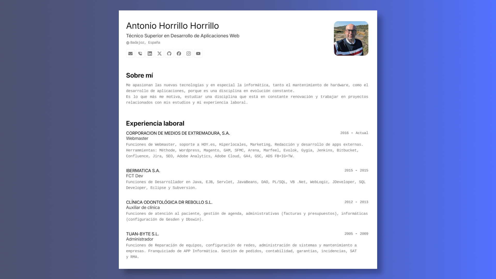

# Arise (Versión 1.1.0) 2024

Arise es mi página personal, con el contenido de mi CV. Diseñado para web y la immpresion en papel y en pdf de forma directa. Esquema del JSON de CV de jsonresume.org. Desarrollada en Astro a partir de la versión de Midudev.



Me apasionan las nuevas tecnologías y en especial la informática, tanto el mantenimiento de hardware, como el desarrollo de aplicaciones, porque es una disciplina en evolución constante.

Es lo que más me motiva, estudiar una disciplina que está en constante renovación y trabajar en proyectos relacionados con mis estudios y mi experiencia laboral.

La página está alojada en la ruta: [https://www.antoniohorrillo.com/]

## 🧞 Control de Cambios

### Cambios Versión v1.1.0

* Update: Nuevos proyectos y cambios en en código y Readme.

### Cambios Versión v1.0.1

* Primer despliegue del proyecto, configuración, y pruebas.

### Primer despliegue v1.0.0

* Primera versión del proyecto v1.0.0.

## 🛠️ Tecnologías utilizadas y Dependencias

### Las tecnologías utilizadas son las siguientes:

* Astro v4.3.2.
* Node v18.20.4
* Npm v10.7.0
* VSCode
* Gimp
* Inkscape

### Las dependencias mas importantes son las siguientes:

* Typescript v5.5.2
* Ninja Keys v0.1.0
* Mailtoui v1.0.3

## 🚀 Ayuda al desarrollador para poner en marcha el proyecto

### Instalación

* Clonar el repositorio:

```bash
git clone https://github.com/antoniohh/Arise.git
```

* Instalar las dependencias:

```bash
npm install
```

* Ponemos a correr nuestra aplicación:

```bash
npm run dev
```

* En el navegador:

```bash
http://localhost:4321/
```

* Realizamos los cambios, modificaciones o correcciones necesarias. Edita el archivo `cv.json` para crear tu propio Portafolio/CV imprimible.

### Empaquetado

* Verificamos la creacion del built y comprobar que todos los procesos de composer son correctos y acaban en OK. Deben estar en `./dist`:

```bash
npm run build
```

### Subida a Producción

* Subir a Git propio. Rellenar las XXXXXXXX con el texto que corresponda:

```bash
git add *
git commit -m "XXXXXXXX"
git push origin XXXXXXXX
```

* Crear los PR de la rama XXXXXXXX a main.

* Identificamos el commit con un nuevo tag.

* Desplegamos con Jenkins en Pro o subimos con el FTP o el sistema que tengamos.

## 🔑 Licencia

[MIT](LICENSE.txt) - Adaptado por [**Antonio Horrillo Horrillo**](https://www.antoniohorrillo.com) y Creado por [**midudev**](https://midu.dev).

Gracias.


## 🧞 Comandos

|     | Comando          | Acción                                        |
| :-- | :--------------- | :-------------------------------------------- |
| ⚙️  | `dev` o `start` | Lanza un servidor de desarrollo local en  `localhost:4321`.  |
| ⚙️  | `build`          | Comprueba posibles errores y hace un empaquetado de producción en `./dist/`.      |
| ⚙️  | `preview`        | Vista previa en local `localhost:4321` |

## 🔑 Licencia

[MIT](LICENSE.txt) - Creado por [**midudev**](https://midu.dev).
